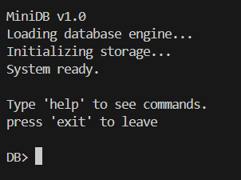
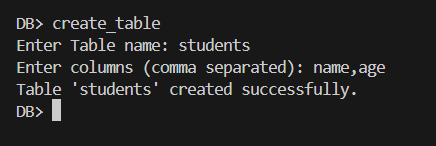
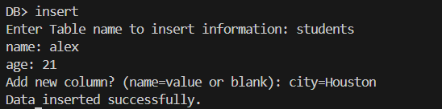
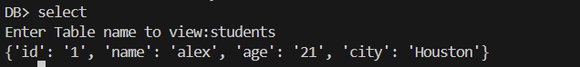
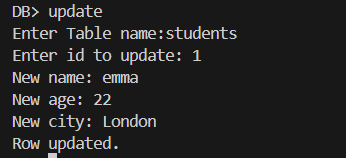
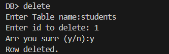
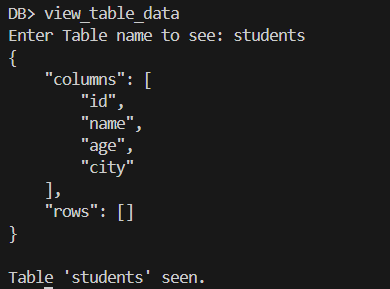
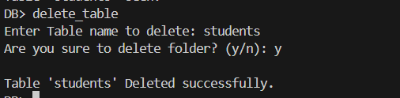
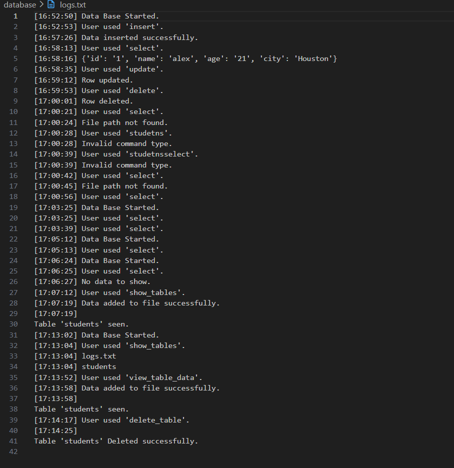

# MiniDB 🗄️

MiniDB is a lightweight command-line database engine written in Python that stores tables as JSON files.
It allows you to create tables, insert records, query data, update rows, and delete entries directly from the terminal.
                         
This project is designed to understand how database systems work internally, including concepts like table schemas, CRUD operations, and command interpreters.

---


## Screenshots

### Main Menu


### Create Folder


### Insert Data


### Select Data 


### Update Data


### Delete Data


### View Table Data


### Delete Table


### Delete Data


### System Logs



## Features

* Create and delete tables
* Store data in JSON files
* Insert records with automatic ID generation
* Select and filter records
* Update existing rows
* Delete rows by condition
* Command-line interface
* Simple logging system
* Automatic column creation during inserts

---


## Installation

Clone the repository:

```bash
git clone https://github.com/Dhruv-Cmds/MiniDataBase.git
cd MiniDataBasecd 
```

Make sure you have Python installed:

```bash
python --version
```

Run the database engine:

```bash
python main.py
```

---

## Usage

Once started, the database will show the command prompt:

```
DB>
```

Type commands to interact with the database.

---

## Database Commands

### Create Table

Creates a new table.

```
create_table
```

Example:

```
Enter Table name: students
Enter columns (comma separated): name,age
```

---

### Show Table

Displays the contents of a table.

```
show_tables
```

---

### Delete Table

Deletes a table file.

```
delete_table
```

---

## Data Commands

### Insert Row

Insert data using key=value pairs.

```
insert students name=alex age=21
```

---

### Select Data

Show all rows:

```
select students
```

Filter rows:

```
select students where age=21
```

---

### Update Row

Update a row using a condition.

```
update students id=1 age=22
```

---

### Delete Row

Delete a row using a condition.

```
delete students id=1
```

---

## Example Session

```
MiniDB v1.0
System ready.

DB> create_table
Enter Table name: students
Enter columns (comma separated): name,age

DB> insert students name=alex age=21 city=Houston country=America

DB> insert students name=emma age=22 city=London  country=UK

DB> select students
{'id': '1', 'name': 'alex', 'age': '21', 'city': Houston, 'country': America}
{'id': '2', 'name': 'emma', 'age': '22', 'city': London, 'country': UK}

DB> update students id=1 age=23

DB> delete students id=2
```

---

## Project Structure

```
MiniDataBase/
│
├── database/  # JSON table storage   
│     └── logs.txt
│     └── students.json
│
├── Databasemain
│     └── database.py     # database engine and CRUD operations
│     └── logger.py       # logging utility
│     └── main.py         # command interpreter and boot system
│
└── README.md
```

---

## How It Works

MiniDB stores each table as a JSON file inside the `database/` directory.

Example table structure:

```json
{
  "columns": ["id", "name", "age"],
  "rows": [
    {"id": "1", "name": "alex", "age": "21"}
  ]
}
```

The engine loads the JSON file, modifies the data in memory, and writes the changes back to disk.

---

## Why This Project

This project demonstrates core database concepts:

* Table schemas
* Data persistence
* Command parsing
* CRUD operations
* Simple query filtering

It is a small but practical step toward understanding how real databases like SQLite or PostgreSQL work internally.

---

## License

This project is open source and available under the MIT License.
